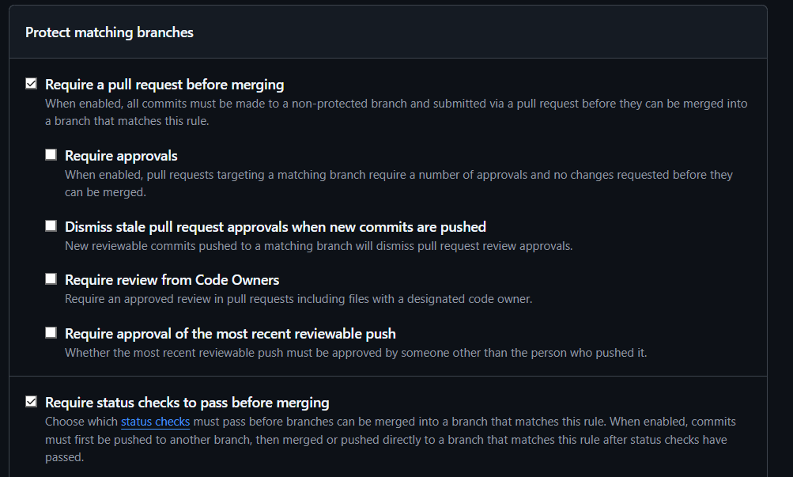

# Currículo Online - DS881

Projeto desenvolvido para a disciplina DS881 utilizando HTML, CSS, Docker, GitHub Actions e GitHub Pages.

## Currículo em Produção

O link para acessar o site é: https://guinh0-0.github.io/ds881-curriculo-GRR20242327/

## Execução Local com Docker

### Pré-requisitos

- Docker
- Docker Compose

### Clonar o repositório

```bash
git clone https://github.com/GUINH0-0/ds881-curriculo-GRR20242327.git
cd ds881-curriculo-GRR20242327
```

### Executar a aplicação

```bash
docker compose up --build
```

### Acessar a aplicação

```text
http://localhost:8080
```

### Encerrar a aplicação

```bash
docker compose down
```

## Proteção da Branch Main

A branch `main` foi configurada com as seguintes regras:

- Require a pull request before merging
- Require status checks to pass before merging

### Evidência



## CI/CD

O projeto utiliza GitHub Actions para:

1. Executar análise estática com HTMLHint e Stylelint.
2. Validar a aplicação durante a etapa de build.
3. Realizar deploy automático para o GitHub Pages após merge na branch `main`.